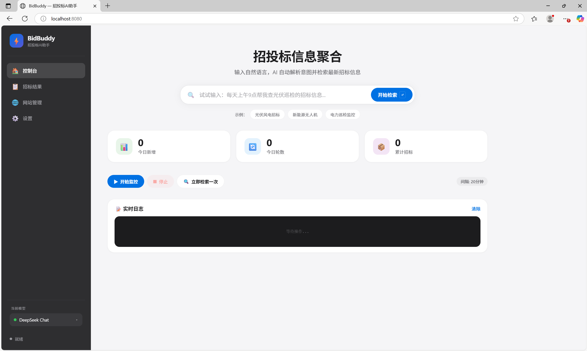

# ⚡ BidBuddy — 招投标AI助手

> 一句话触发 · 智能抓取 · 多模型驱动  
> Apple 极简风界面 · 超聚变赛题作品

---

## 📸 预览



## 🎯 项目简介

本项目为 **AI 先锋未来人才大赛 Synapse 小组** 参赛作品，基于开源项目 [zhiqianzheng/BidMonitor-AI](https://github.com/zhiqianzheng/BidMonitor-AI) 完整复现，并完成 **六大维度优化升级**：

| # | 优化维度 | 原始项目 | 本项目升级 |
|---|---------|---------|-----------|
| 1 | **UI 布局** | 移动端底部 Tab 导航 | 桌面端毛玻璃侧边栏，适配电脑端使用 |
| 2 | **输入交互** | 基础关键词输入框 | 支持自然语言的 Spotlight 快捷搜索框 |
| 3 | **模型能力** | 3 个硬编码模型 | 13+ 可自由切换模型卡片，5 大厂商 |
| 4 | **代码架构** | 单文件 app.py | src/ 模块化分层结构，易维护迭代 |
| 5 | **日志机制** | 轮询拉取 | SSE 服务端实时推送，日志即时刷新 |
| 6 | **操作体验** | 文本框填模型名 | 侧边弹窗式模型选择面板，可视化切换 |

## 🤖 多模型支持

| 提供商 | 模型 |
|--------|------|
| 🐋 DeepSeek | deepseek-chat · deepseek-v4-pro |
| 🧠 OpenAI | gpt-4o · gpt-4 · gpt-3.5-turbo |
| 🏮 智谱AI | GLM-4 · GLM-4 Flash |
| 🌙 月之暗面 | moonshot-v1-8k · moonshot-v1-32k |
| ☁️ 阿里云 | qwen-turbo · qwen-plus · qwen-max |
| 🔧 自定义 | 任意 OpenAI 兼容 API |

## 🚀 一键启动

```bash
# 1. 安装依赖
pip install -r requirements.txt

# 2. 启动服务
python app.py

# 3. 浏览器打开
# http://localhost:8080
```

## 🏗️ 技术架构

```
bidbuddy/
├── app.py                    # FastAPI 主入口，一键启动
├── requirements.txt          # Python 依赖
├── start.bat                 # Windows 一键启动脚本
├── src/
│   ├── core.py               # 核心引擎（爬虫调度 + 匹配 + AI 过滤）
│   ├── llm_client.py         # 统一多模型 LLM 客户端
│   ├── storage.py            # JSON 文件存储引擎
│   ├── matcher.py            # AND/OR/NOT 关键词匹配器
│   ├── scheduler.py          # APScheduler 定时任务封装
│   └── crawler/              # 17 个招标网站爬虫模块
├── static/
│   ├── index.html            # Apple 极简风主页面
│   ├── css/style.css         # 毛玻璃 · 大圆角 · SF字体
│   └── js/app.js             # SSE 实时日志 · 多模型切换
└── data/                     # 运行时数据目录
```

### 技术栈

| 层 | 技术 |
|----|------|
| 后端框架 | FastAPI + Uvicorn |
| 前端 | 原生 HTML/CSS/JS（Apple 极简设计系统） |
| 爬虫 | requests + BeautifulSoup4 + Selenium |
| 定时任务 | APScheduler |
| 实时推送 | Server-Sent Events (SSE) |
| AI 集成 | 统一 LLM Client（5 厂商 13+ 模型） |
| 数据存储 | JSON 文件存储 |

## 🎨 设计亮点

- **毛玻璃侧边栏**：`backdrop-filter: blur(30px)` 深色毛玻璃
- **Apple 风格**：SF 字体 · 大圆角卡片 · 胶囊按钮 · 弹性动效
- **Spotlight 搜索**：居中大输入框，focus 蓝色光环
- **实时体验**：SSE 秒级日志推送 + 进度条可视化
- **响应式**：桌面优先，侧边栏自动折叠适配小屏

## 📋 比赛信息

| 项目 | 内容 |
|------|------|
| 组名 | Synapse |
| 赛题 | 飞书AI先锋未来人才大赛 |
| 目标企业 | 超聚变数字技术股份有限公司 |
| 命题 | 招投标信息智能聚合工具 |

## 📄 License

MIT

---

*Made with ❤️ for 飞书AI先锋未来人才大赛 · Synapse Team*
